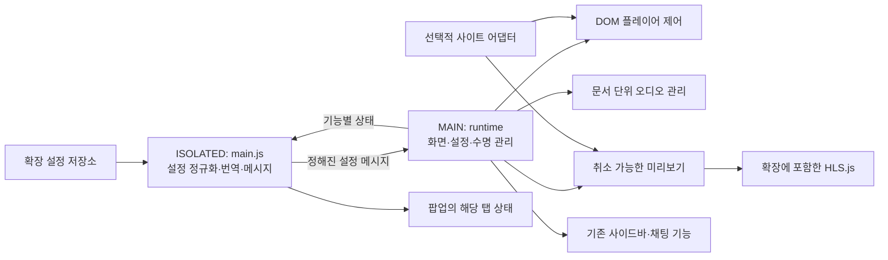

# Cheese Knife 치지직 호환성 복구 설계

작성일: 2026-10-08 (Asia/Seoul)

상태: 공격적 자체 검토를 반영한 설계. 구현 및 실서비스 호환성 검증 전.

검토 기록: [공격적 검토](../reviews/2026-10-08-chzzk-compatibility-review.md)

## 1. 목적과 범위

사용자는 GitHub Desktop으로 복제한 `jebibot/cheese-knife`를 현재 Chrome의 치지직에서 다시 사용할 수 있게 만들고, `scweeny/cheese-knife`의 수정도 참고하기를 요청했다. 이번 산출물은 그 복구 설계와 공격적 검토이다.

복구의 성공 기준은 버튼의 생성이 아니라 실제 기능의 동작, 기존 시청의 유지, 화면 전환 후 정상 작동이다. 기존 설정 키와 한국어/영어 번역을 유지한다. Chrome을 우선 검증하고 Firefox 지원은 별도로 검증 상태를 기록한다.

이번 설계는 기존 기능을 유지하는 제한적인 구조 변경이다. 플레이어, 컴프레서, 미리보기와 이들의 초기화/해제를 작은 단위로 분리한다. 제품 전체의 TypeScript 전환, React/Vue 도입, 스토어 배포, 새 기능 추가는 포함하지 않는다.

전체 복구 여부는 기능별 검증표로 판단한다. 내부 API에 의존하는 통계·삭제된 채팅·사이드바 갱신을 검증하지 못한 채 “전체 정상”으로 표시하지 않는다. 지원 불가 기능은 기능 단위로 표시하며, 다른 기능은 계속 실행한다.

## 2. 기준 코드와 증거 수준

| 대상 | 고정 기준 | 조사 결과 |
| --- | --- | --- |
| 로컬 및 이전 조사에서 조회한 원본 main | `5ccb2bfdb660534c6fb64ceda511124ae3784416`, v2.13.1 | Manifest V3, Chrome 최소 121, 테스트 명령 없음 |
| scweeny main | `493011729f9e49486254c34c1f6395b9626893ee` | 기준 코드 이후 커밋 하나. `web/inject.js` 변경과 `web/inject.js.bak` 추가 |
| 원본 PR #70 | `38309db02479868df12d36dffb4d44e379fe090d` | HLS.js fallback과 manifest 변경. 현재 build는 vendor 폴더를 복사하지 않음 |
| 원본 PR #74 | `cec73ba94e110d429e5c7f639a7f483ed2200321` | 채널 페이지 판별 보완. profile 링크 구조에도 의존 |
| 원본 PR #76 | `de32a0447e5c492c73b50c8fafd408da068bc341` | 루트의 `inject.js`만 추가. manifest는 `web/inject.js`를 참조하므로 그대로 적용되지 않음 |

출처: [원본 저장소](https://github.com/jebibot/cheese-knife), [포크 커밋](https://github.com/scweeny/cheese-knife/commit/493011729f9e49486254c34c1f6395b9626893ee), [PR #70](https://github.com/jebibot/cheese-knife/pull/70), [PR #74](https://github.com/jebibot/cheese-knife/pull/74), [PR #76](https://github.com/jebibot/cheese-knife/pull/76). SHA 기준이며 이후 원격 변경은 별도로 비교해야 한다.

### 2.1 확인한 사실

- 코드상 `getWebpackRequire`는 특정 전역과 모듈 번호 `49588`, `44414`에 의존한다. 전역이 없으면 Promise가 거부된다.
- 실제 원본 함수 조각을 Node VM에서 실행했을 때 전역 부재의 `TypeError`와 이후 동기 코드 실행을 함께 확인했다. 이것만으로 전체 IIFE의 즉시 중단을 설명할 수 없다.
- 코드상 `initPlayerFeatures`는 `pzp.__vue__`가 없으면 50ms 간격으로 500회를 넘길 때까지 재시도하고 반환한다. 따라서 Vue 부재 시 해당 함수의 UI 초기화는 수행되지 않는다.
- 이전 조사에서 Chrome DOM의 `#root`, `#layout-body`, `#live_player_layout`, `.pzp-pc`와 확장 프로그램의 필터/i18n 노드를 관찰했다. 새 탭에서는 추가 플레이어 버튼이 없었다. 이는 기능 부재의 증거이며 정확한 실패 지점의 증거는 아니다.
- 포크의 실제 페이지 분류 함수를 `/video/123456` + `.pzp-pc` 조건에서 실행하면 `attachLiveObserver`를 선택한다. 원본은 같은 조건에서 `attachVodObserver`를 선택한다.
- 필터는 `web/main.js`에서 별도로 동작한다. 앞선 설명의 “Vue 부재로 영상 필터까지 모두 포기”는 코드 구조와 일치하지 않는다.

### 2.2 아직 확정하지 않은 사항

이전 브라우저 평가에서 webpack, Vue, React expando가 보이지 않았으나 평가가 페이지 MAIN world를 직접 읽는다는 보장이 없었다. Chrome의 실행 환경은 DOM을 공유하더라도 JavaScript 변수/객체가 격리될 수 있다. 따라서 “현재 치지직에서 webpack/Vue/React가 제거됨”은 아직 확정하지 않는다. [Chrome 실행 환경 문서](https://developer.chrome.com/docs/extensions/develop/concepts/content-scripts)

구현 첫 단계는 확장 프로그램 자체 MAIN 코드의 제한된 진단으로 이 가설을 확인하는 것이다. 진단에는 기능 이름·존재 여부·단계·오류 코드만 기록하고 토큰, 쿠키, URL query, 채팅 본문, 전체 React 객체를 출력하지 않는다.

다음은 각각 별도 실브라우저 확인이 필요하다: 실제 라이브/다시보기 구조, 내장 키보드 처리, 코어 플레이어 접근, HLS 경로와 인증/CORS/CSP, 음성의 Web Audio 호환성, 채팅 상태 연결점, 사이트 기본 새로고침 동작.

## 3. 접근 방식 결정

| 방식 | 장점 | 결함/비용 | 판단 |
| --- | --- | --- | --- |
| 포크 커밋 통째 적용 | 빠른 비교 가능 | VOD 오분류, 전역 탐색, 오디오 수명 관리 및 패키징 보완 필요 | 참고 구현으로만 사용 |
| 기능별 표준 API 복구 + 선택적 사이트 어댑터 | 내부 객체 변화가 기능 전체에 전파되지 않음. 회귀를 기능별 검증 가능 | 소규모 모듈 분리와 실제 미디어 검증 필요 | 채택 |
| 확장 전체 재작성 | 구조를 새로 통일 가능 | 기존 설정·스타일·기능 회귀 범위가 커짐 | 이번 범위에서 제외 |

내부 플레이어를 발견하면 검증된 인터페이스에 한해 활용한다. 내부 모듈 번호나 Vue는 표준 기능의 선행 조건이 되지 않는다. 무제한 객체 재귀 탐색이나 페이지의 모든 webpack 전역에 코드 주입은 하지 않는다.

## 4. 구성과 데이터 흐름

MAIN 코드는 DOM/미디어와 선택적 사이트 객체에 접근한다. 저장소와 `chrome.*` API는 ISOLATED에 남긴다. frame별 runtime은 독립적이며 부모 창의 video나 AudioContext를 사용하지 않는다.

### 4.1 예정 파일 책임

| 파일 | 책임 |
| --- | --- |
| `web/runtime.js` (신규) | frame별 인스턴스, route 분류, 리소스 scope, 단일 DOM 감시, 상태 보고 |
| `web/site-adapter.js` (신규) | 검증한 내부 플레이어/HLS/React 연결점만 제공. 표준 기능에 필수 아님 |
| `web/player.js` (신규) | 현재 주 플레이어의 버튼·탐색·VOD 길게 누르기·통계 UI |
| `web/audio.js` (신규) | 문서 단위 AudioContext와 video별 source/graph 및 컴프레서 UI 연결 |
| `web/preview.js` (신규) | 요청/hover 세대, 재생 backend, 캐시, HLS 해제 |
| `web/inject.js` (기존 수정) | 위 단위 연결과 기존 사이드바/채팅 동작. 해당 중복 코드를 이관 |
| `web/main.js`, `config.js` | 설정 기본값 병합, 형식 검증, 번역 handshake, 상태 relay |
| `popup.js`, `popup.html`, `_locales/*/messages.json` | 현재 탭에서 기능의 준비/제한/실패 상태를 간결하게 표시 |
| `web/main.css` | Vue UI를 대체한 제어의 표시·키보드 포커스. 기존 `.knife-*` 숨기기 스타일 유지 |
| `vendor/hls.light.private.js`, `vendor/hls.js.LICENSE` (신규) | 고정 버전 HLS.js를 전역 `window.Hls` 충돌 없이 포함 |
| `scripts/build.mjs`, `scripts/check-package.mjs` (신규) | Windows/Linux 빌드와 manifest 참조·라이선스·배포 파일 검사 |
| `tests/*.test.cjs`, `tests/fixtures/*` (신규) | Node 내장 테스트 + jsdom 회귀 검사, 민감 정보 없는 DOM/응답 fixtures |
| `manifest.json`, `package.json`, `package-lock.json` | 로딩 순서·테스트·빌드 의존성. 기존 설정 저장 형식 유지 |

각 신규 MAIN 파일은 classic script의 작은 IIFE로 같은 버전의 runtime registry에 등록한다. 전용 registry는 다른 페이지 전역을 덮어쓰지 않으며, 보안 경계로 간주하지 않는다. manifest의 MAIN JS 순서는 `runtime → private HLS → adapter → audio → player → preview → inject`이다. 파일별 top-level 등록은 제한하고, 선택적 라이브러리의 초기화 실패가 후속 필수 파일 실행을 막지 않도록 coordinator가 가용성을 검사한다.

소스 폴더를 unpacked로 로드해도 같은 파일들이 존재해야 한다. 배포 폴더만 생성되는 파일에 manifest를 의존시키지 않는다. HLS.js는 build 때 라이브러리를 다운로드하지 않고, 검증한 upstream 배포 파일을 private wrapper에 포함해 체크인한다. wrapper는 UMD export를 로컬 객체로 받아 페이지의 `window.Hls`를 건드리지 않는다. 원본 버전·SHA-256·출처·wrapper 변경점을 고지한다.

## 5. 초기화와 화면 수명

### 5.1 설정/번역 handshake

ISOLATED는 메시지 listener를 먼저 등록하고 저장소를 읽는다. `DEFAULT_CONFIGS`와 저장된 키를 병합하고 타입/범위를 확인한 설정 및 i18n을 보낸다. `getConfig`의 저장소 기본값만으로 부분 객체의 모든 키가 복구된다고 가정하지 않는다.

메시지 계약은 namespace `cheese-knife`, `protocol: 1`, `type`, `requestId`를 포함한다. 설정 요청/응답과 기능 상태만 허용한다. 각 수신자는 `event.source === window`, 동일 origin, object payload, type와 각 field를 검증한다. null이나 타 사이트의 일반 `config` 메시지는 무시한다. 같은 origin의 페이지가 메시지를 위조할 수 있으므로 이것을 인증으로 취급하지 않으며, bridge는 임의 URL fetch·스크립트 실행·저장소 변경을 제공하지 않는다.

MAIN은 변수·오디오 관리자·수신 listener를 모두 초기화한 뒤 설정 요청을 시작한다. 요청은 100ms 간격 최대 20회, 첫 유효 응답에서 중지한다. DOM 관찰은 설정과 별도로 시작한다. 설정 응답 전에는 효과·자동 컴프레서·미리보기 요청을 활성화하지 않는다. 2초 안에 응답이 없으면 상태를 `limited/config-unavailable`로 표시한다. 이후 유효 응답이 오면 그대로 복구한다.

번역은 같은 응답에 포함되어 script 간 실행 순서에 기대지 않는다. 설정 변경은 단일 검증/적용 경로를 쓰고, 늦은 초기 응답이 이미 적용된 새 설정을 덮어쓰지 않도록 revision을 증가시킨다. 프로토콜 namespace/version과 기존 저장 키는 별개이다.

### 5.2 route와 플레이어 선택

- `/live/<채널 ID>` 및 확인한 `/live/<채널 ID>/chat`는 live이다.
- `/video/<동영상 ID>`는 VOD이다. `.pzp-pc`가 있다는 이유로 live로 분류하지 않는다.
- 채널 화면은 정확한 채널 ID 경로와 채널 탭/채널 링크 확인을 모두 사용한다. `/following`, `/lives`, `/clips`, `/settings` 등 일반 경로의 tablist에 채팅 버튼을 넣지 않는다.
- 나머지 화면은 explore/unsupported로 분류하며, 제외 URL은 첫 로드와 SPA 이동에서 동일하게 적용한다.

플레이어는 해당 route의 `#live_player_layout` 또는 `#player_layout` 아래에서 선택한다. 레이아웃 ID가 바뀐 경우에만 `#layout-body`의 주 콘텐츠 안에서 `.pzp-pc`를 후보로 확인한다. 하나로 결정하지 못하면 player 기능을 보류한다. `.knife-preview`, 팝업 컨테이너, 보조/광고 video는 주 플레이어 후보에서 제외한다. 초기 노드가 selector 자체에 매치하는 경우와 자식에 매치하는 경우를 모두 처리한다.

### 5.3 감시·재시도·해제

root가 늦거나 교체되어도 동작하도록 document의 안정된 상위 노드에서 구조 변화를 감시한다. `#layout-body`와 player에 관심을 좁히며, 각 scope당 observer를 하나만 등록한다. MutationObserver 알림은 animation frame당 한 번의 reconcile로 합치고 변경이 관계없는 subtree면 full scan하지 않는다.

route, 콘텐츠 root, player DOM, **같은 player 안의 video 객체** 중 하나가 바뀌면 해당 scope를 갱신한다. `popstate`/`pageshow`와 DOM reconcile에서 URL을 읽는다. DOM이 유지되는 pushState 변경도 놓치지 않도록 페이지가 visible일 때 1초 주기의 URL 비교 하나를 두며 route 변경 때만 처리한다. hidden에서는 멈추고 다시 visible일 때 바로 reconcile한다. history 메서드 자체는 덮어쓰지 않는다.

각 scope는 generation과 AbortController, observer, timer, event 제거 및 adapter 복원 목록을 소유한다. dispose는 멱등이다. 변경된 제어 subtree는 다시 mount할 수 있다. 단순 `dataset.knifeObserved` 표시가 UI 재생성이나 video 교체까지 해결한다고 가정하지 않는다.

사이트 연결점 재시도는 100ms 간격 최대 20회/한 route generation, detached 또는 취소 시 즉시 종료한다. 없으면 `limited`로 기록하고 다음 관련 DOM/route 변화에서 다시 발견을 시도한다. 기능마다 25초짜리 폴링이 중첩되지 않는다. 비동기 결과는 완료 시 generation과 연결 상태를 다시 확인한다.

`pagehide`의 `persisted: true`는 미리보기·timer만 정지시키고 bfcache 복귀에 필요한 audio/runtime을 파괴하지 않는다. `pageshow`에서 갱신한다. 최종 문서 unload는 브라우저의 오디오 종료 동작에 맡긴다.

## 6. 표준 플레이어 기능

### 6.1 실시간 이동과 방향키

fast-forward 버튼은 frame의 현재 player에 하나만 붙이며 마지막 유효 재생 범위의 끝으로 이동한다. live route를 기준으로 동작하고 `duration === Infinity`를 필수로 하지 않는다. 빈 범위에서는 비활성/무동작이다.

탐색은 검증한 seekable 범위를 우선 사용하고, 없으면 buffered 범위를 사용한다. 5초 목표 시각을 유효한 구간 안으로 제한하며 구간 사이의 빈 공간에 위치시키지 않는다. 마지막 끝점에는 최대 50ms의 내부 여유를 적용하고, 길이가 짧은 구간도 역전되지 않도록 제한한다. live 복귀와 뒤로 이동 상태는 player별로 관리한다.

키보드는 현재 주 플레이어에만 적용한다. input, textarea, contenteditable의 자손, slider, select, IME 조합 입력 및 modifier 조합에서는 소비하지 않는다. 미리보기나 팝업의 video를 건드리지 않는다. 한 키 입력이 사이트 기본 처리와 중복되어 10초 이동하지 않는 것을 실브라우저에서 확인한다. 내장 탐색이 정상 동작하는 경우에는 확장 탐색을 중복 설치하지 않는 adapter 정책을 사용한다. 이 정책의 탐지 가능 여부는 D0의 검증 항목이며 추측 기반의 DOM class만으로 완료 처리하지 않는다.

HLS 동기화/버퍼 조작은 optional adapter이다. 원본의 buffer 설정 1000배 확대/Infinity 정책은 기본 복구에서 이식하지 않는다. 내장 엔진이 탐색을 즉시 live edge로 돌려놓는다면 표준 탐색만으로 복구됐다고 판정하지 않는다. 검증한 API/사이트의 DVR 기능을 쓰는 제한적 adapter가 필요하며 그것도 실패하면 해당 기능을 `limited`로 표시한다.

### 6.2 VOD 길게 눌러 2배속

주 video의 `playbackRate`, paused 상태를 직접 읽어 500ms의 길게 누르기에서 2배속을 적용한다. 시작 지점에서 10px 넘게 움직이면 시작을 취소한다. 활성화 전 손을 떼면 rate/paused 상태를 변경하지 않는다. 정지 영상의 재생이 거부되면 정상 정리한다.

pointerup, pointercancel, focus 상실, route/video 교체, pagehide에서 indicator·pointer capture·timer를 정리한다. 종료 시 확장이 적용한 rate가 아직 유지되고 있을 때만 원래 rate를 복원해 사용자의 다른 속도 변경을 덮어쓰지 않는다. paused 복원도 확장이 재생시킨 video에만 적용한다. 전역 코어 객체를 찾느라 포인터 종료 event의 등록이 늦어지지 않는다.

### 6.3 통계

기존 context menu의 확실한 위치에 메뉴를 하나 추가한다. menu 재생성 때 다시 연결하고 overlay/timer를 player scope에서 해제한다. 임의 document.body로 overlay를 옮기지 않는다.

표준 video API의 해상도·프레임 통계를 가용한 범위에서 사용한다. FPS는 관찰 구간의 프레임 변화 기반 측정값임을 표시하고, 실제 표시 가능한 경우에만 제공한다. bitrate·코덱·live latency는 검증한 adapter 값이 있어야 표시한다. buffered end와 currentTime 차이를 서버 기준 지연시간으로 바꾸어 표시하지 않는다. 값이 없으면 `알 수 없음`으로 표시하고 수치를 만들지 않는다. 읽기 전용 조회에서 미디어 객체를 수정하지 않는다.

## 7. 컴프레서: UI와 오디오 수명을 분리

document/frame당 AudioContext 하나와 `WeakMap<HTMLVideoElement, AudioEntry>`를 사용한다. UI scope가 사라져도 같은 video의 source/graph는 재사용한다. 관리자의 source index는 WeakMap으로 유지하고, 활성 UI 구독만 강한 참조로 추적한다. audio node가 media를 유지할 수 있는 자원 제한은 문서 수명 동안 기록하고 테스트한다.

UI state는 `off → pending → on` 또는 `unavailable`이다. 기본값은 기존처럼 off이고 기존 `compressorDefault` true는 **요청 상태**로 적용한다. 새 탭에서 실행 허용이 확인되기 전에는 on으로 표시하지 않는다.

### 7.1 안전한 시작

1. 현재 주 video와 지원 가능한 소스임을 확인한다. 다른 video/미리보기 및 검증되지 않은 보호 스트림에는 연결하지 않는다.
2. AudioContext 생성/`resume()`를 요청하고 running을 확인한다. 최초 source 연결은 running 확인 전에는 하지 않는다. 응답이 1초 이상 pending이면 해당 시도는 취소하고 on으로 표시하지 않는다. 늦은 완료도 최신 요청 generation을 검사한다.
3. compressor, gain 및 출력 경로를 준비한 뒤, 그 video에 처음 한 번만 `createMediaElementSource`를 호출한다. 이 호출은 미디어 오디오 경로를 바꾸는 지점이므로 모든 이후 실패 경로를 bypass로 연결 가능하게 구성한다.
4. 성공한 경우에만 on을 표시한다. source 생성이 거부되면 기존 video의 소리/재생을 바꾸지 않고 unavailable을 표시한다.

정지 상태의 AudioContext는 사용자 동작 이후 resume이 필요할 수 있다. 자동 on 설정도 정책을 우회하지 않는다. [Chrome autoplay 문서](https://developer.chrome.com/blog/autoplay)

### 7.2 graph와 토글

source에서 dry gain과 compressor → gain → wet gain의 두 경로를 만들고 destination으로 연결한다. 연결은 최초 한 번이며 토글은 짧은 gain 전환으로 수행한다. dry/wet의 합은 1을 유지해 이중 출력으로 소리가 커지는 오류를 방지한다. off에서는 dry=1/wet=0, on에서는 dry=0/wet=1이다. 사용자의 video.volume/muted를 바꾸지 않는다.

threshold `[-100,0]`, knee `[0,40]`, ratio `[1,20]`, attack/release `[0,1]`, gain `[0,2]`의 유한 숫자만 적용한다. 잘못된 저장값은 기본값 threshold=-50, knee=40, ratio=12, attack=0, release=0.25, gain=1로 복구한다. slider step은 0.05이고 한국어/영어 label과 키보드 제어를 제공한다. 저장 키 `knifeGain`은 유지한다.

UI 재생성/일반 route 해제에서는 graph를 bypass로 바꾸되 context를 close/suspend하지 않는다. 같은 video가 재사용될 수 있기 때문이다. detached만으로 video가 영구 폐기됐다고 단정하지 않는다. 라이브의 사이트 미니플레이어가 해당 video를 유지할 경우에는 소리를 이어간다.

DOM에 연결되지 않고 paused 상태가 5초 유지되며 주 player/확인한 미니플레이어 어느 쪽에도 속하지 않는 video는 출력 연결과 UI 강한 참조를 해제한다. entry/source는 WeakMap에 남겨 같은 media 재사용 시 다시 연결할 수 있게 하되 media를 별도 배열/타이머 closure에 계속 보관하지 않는다. 현재 출력에 연결된 항목만 별도로 추적한다. 재삽입 또는 재생 시 reconnect는 DOM/media 관찰 경로에서 수행한다. 문서 전체 context는 살아 있는 재사용 media를 위해 유지하며, destination 연결이 오래된 video를 계속 유지하는 누수를 heap/활성 graph 수로 검사한다.

Web Audio로 전환한 뒤 CORS 제한 때문에 무음이 된 경우 direct destination bypass만으로 원래 native 경로가 돌아온다고 보장할 수 없다. 따라서 지원 확인 전에는 소스를 가로채지 않는다. 발생하면 실패 상태와 페이지 reload 복구 안내를 제공하고, 검증되지 않은 스트림에서 자동 on을 막는다. [Web Audio 소스와 보안 규정](https://www.w3.org/TR/webaudio/#MediaElementAudioSourceNode), [AudioContext 종료](https://www.w3.org/TR/webaudio/#dom-audiocontext-close)

실제 audio 청취/샘플 검증은 필수이며 jsdom의 fake AudioContext 통과로 이 조건을 대신하지 않는다.

## 8. 방송 미리보기

### 8.1 backend 선택

검증한 내장 CorePlayer/LiveProvider의 생성·재생·해제가 가능하면 사용한다. 탐색은 해당 페이지의 확인한 연결점에 한정하고 최대 2초 후 포기하며 화면 핵심 기능은 이를 기다리지 않는다. 연결점이 실패하면 확장에 포함된 private HLS.js 또는 실제 `canPlayType`가 지원하는 native HLS를 사용한다.

PR #70의 HLS.js 1.6.16은 비교 기준이다. 구현에서 이 버전을 사용할 경우 공식 배포 출처·파일 hash·라이선스와 보안/플랫폼 적합성을 확인하고 고정한다. 다른 버전을 선택하면 근거와 검증 결과를 dependency 변경에 기록한다. runtime에서 CDN 스크립트를 받지 않는다.

media ID가 HLS인지뿐 아니라 유효한 HTTPS path, 실제 플레이리스트와 브라우저 지원을 검증한다. LLHLS만 제공하는 응답은 지원 가능성을 별도로 검증한다. DRM/인증 실패/비호환 경로에서는 thumbnail로 복귀하고 이유를 상태에 기록한다. 같은 hover에서 backend fallback은 한 번만 수행한다.

MAIN world의 HLS에는 페이지 CSP가 적용될 수 있으며 content-script fetch는 host permission만으로 CORS를 면제받지 않는다. worker 사용을 위해 페이지 정책을 변경하지 않는다. 먼저 `enableWorker:false`로 fallback을 검증하고, main thread 부하가 허용되는지 측정한다. [Chrome content scripts](https://developer.chrome.com/docs/extensions/develop/concepts/content-scripts), [네트워크 요청](https://developer.chrome.com/docs/extensions/develop/concepts/network-requests), [HLS.js API](https://github.com/video-dev/hls.js/blob/master/docs/API.md)

기본 설계에는 service worker를 통한 범용 fetch proxy나 CDN 전체 host permission을 추가하지 않는다. 실제 API 접근이 CORS 때문에 불가능하면 API channel ID만 받는 제한된 broker 등의 변경을 설계에 추가하고 권한/쿠키 전달/서비스 워커 중단까지 재검토한다. segment까지 proxy하는 우회 구현으로 확장하지 않는다.

### 8.2 취소와 캐시

문서/frame당 미리보기 하나만 실행한다. hover의 request generation을 즉시 증가시키고 이전 fetch를 abort한다. 모든 await 이후 generation, route, anchor 연결 상태를 확인한다. 취소를 서버가 무시해도 늦은 결과는 UI를 바꾸지 못한다. anchor의 URL이 같은 DOM 객체에서 바뀌는 경우도 새 generation이다.

live-detail cache는 채널 ID별 최대 100개, 양성 TTL 30초, 음성 TTL 5초이다. 실행 중인 요청은 중복 제거하되 취소된 요청을 새 hover가 잘못 공유하지 않게 한다. liveId/방송 상태 변경이나 stream 오류 때 해당 playback 정보는 무효화한다. 서명 있는 URL을 장기 보관하지 않는다.

화면 표시 지연은 기존 previewDelay(0.1~3초)를 따르고, stream 재생은 사용자가 hover를 유지할 때만 준비한다. 우선 480p 이하/동급 track을 선택하고 스트림이 준비되면 표시한다. 준비 대기 최대 5초 후 썸네일 상태를 유지한다. muted autoplay로 시작하며 명시적인 동작에서만 previewVolume을 적용해 음소거를 해제한다. play 실패는 한 번 처리하고 무제한 재시도하지 않는다.

hover 해제, route 변경, 탭 hidden, pagehide, backend 교체에서 fetch/timer/animation/metadata listener를 취소하고 HLS.destroy(), video.pause(), src/srcObject 제거 및 필요 시 load()로 확장 소유 video를 해제한다. request 결과가 이후 다시 재생시키지 못한다. 주 방송 video에는 이 정리 코드를 적용하지 않는다.

썸네일·uptime만 동작하는 경우 livePreview가 성공한 것으로 표기하지 않는다. 미리보기의 우클릭 음소거 해제는 기존 썸네일에 적용된 동작과 새 미리보기에서 지원하는 동작을 구분해 실제 hit target/keyboard/접근성을 검사한다.

## 9. 기존 기능의 보존과 제한 처리

| 기능 | 복구/검증 정책 |
| --- | --- |
| 영상 필터 | 기존 ISOLATED SVG 경로 유지. 설정 handshake와 MAIN 실패를 독립 검증 |
| 채팅 크기 조절 | DOM 핸들을 chatController 발견 전에 연결. 왼쪽 채팅/접힘/세로 화면과 CSS 설정 확인 |
| 채팅 폰트와 스타일 | 기존 설정 키·CSS 파일·새로고침 정책 유지. 새 DOM fixture 및 실제 페이지로 selector 확인 |
| 후원 채팅 숨기기 | 검증한 chatController filter를 기능별 연결. type=10이 현재 후원만 의미하는지 확인 |
| 삭제된 채팅 표시 | JSX factory/이벤트 구조 확인 시만 연결. 기존 listener를 보존하고 필요한 데이터가 없으면 제한 표시 |
| 채팅 시각 | 해당 row의 확인한 props/time만 사용. root child 변경 외 기존 행/virtualized 재사용 처리도 검사 |
| 사이드바 갱신/펼치기 | 검증한 사이트 동작만 호출. 추측한 React effect를 반복 실행하지 않음. 지원 불가를 다른 기능과 분리 |
| 팝업 플레이어 | 기존 iframe 방식 유지. draggable listener 중복, 생성 URL의 치지직 live 경로, frame별 상태를 확인 |
| 채널 채팅 버튼 | 정확한 채널 경로 + 페이지 문맥 조건, 버튼 하나, 내부 navigator 실패 시 정상 URL 이동 |
| 통계 메뉴 | 현재 menu 위치와 adapter/표준 값 가용성을 검증. 누락된 수치와 메뉴 중복을 별도로 검사 |

adapter monkey patch는 원본 함수와 교체 함수 identity를 기록한다. dispose 시 현재 함수가 우리가 설치한 함수일 때만 원본으로 복원한다. 새 controller와 config 업데이트를 구분하며, controller의 단일 `knifePatched` flag로 여러 기능의 완료를 표현하지 않는다.

## 10. 기능 상태와 실패 격리

상태는 기능별 `pending`, `ready`, `limited`, `failed`, `disabled`와 짧은 reason code이다. `ready`는 그 기능의 필요한 연결점/준비 완료를 의미하며, 출시 검증 PASS와는 다르다. popup에는 현재 active tab/frame의 주 기능 상태를 노출하고, 프레임 상태를 다른 탭에 섞지 않는다. unsupported와 사용자가 off로 설정한 disabled를 구분한다.

구조 탐색 timeout이나 선택적 adapter 실패는 제한 상태다. 처리 실패는 해당 기능 scope에서 catch하고 기록한다. empty catch로 모두 삼키거나 Promise를 reject 상태로 방치하지 않는다. 구조가 바뀌면 재발견하되 동일 reason의 로그는 한 scope당 한 번만 기록한다.

진단은 메모리에서 최근 20개 상태 전환만 유지하고 자동 업로드·사용자 데이터 수집을 추가하지 않는다. popup UI에는 사용자가 대응할 수 있는 기능명·상태·reload 안내만 표시한다.

## 11. 테스트와 출시 판단

### 11.1 자동화의 책임

Node 내장 test runner + jsdom을 사용하며 실제 production classic scripts를 로드해 동작을 검사한다. 테스트를 위해 소스 문자열에 함수를 끼워 넣거나 production을 문자열로 검사하는 방식은 회귀 suite에 쓰지 않는다. fixture/fake는 외부 fetch·미디어 재생·Web Audio 경계만 대체한다.

필수 회귀 사례는 아래 검토표의 R01~R16 및 다음이다.

- webpack/Vue/React 없음, root 지연/교체, 설정 및 번역의 순서 반전·부분 설정·손상된 localStorage.
- live A→VOD B→explore→live C, bfcache 복귀, 같은 player의 video 교체, controls만 재생성.
- 빈/불연속/짧은 TimeRanges, finite live duration, 주 video+preview+보조 video 공존.
- 빠른 pointer 해제, cancel, focus 상실, 사용자 속도 변경, 설정 off 중인 키보드 이벤트.
- 컴프레서 빠른 20회 토글과 늦은 resume, video 재사용, source 중복 생성 거부, invalid params.
- hover A의 응답이 B보다 늦게 도착, 같은 채널 재방송, hide 직후 loadedmetadata, HLS/network 오류.
- 동일 route 10회 초기화에서 observer/button/event/timer 중복 없음, dispose 후 늦은 callback 무효.
- 패키지에는 manifest의 JS/CSS/HTML/icon/locales 및 private vendor/라이선스가 모두 존재.

수정은 재현하는 실패 테스트를 먼저 확인한 다음 필요한 코드만 변경한다. 테스트가 모사한 AudioContext 호출을 통과하더라도 실제 소리의 안전성이나 CORS/MSE 재생을 증명한 것으로 쓰지 않는다.

### 11.2 실제 Chrome 검증

별도 검증 표에 각 사례의 Chrome 버전, 날짜, 기능, PASS/FAIL/UNVERIFIED, 증거 및 제한을 기록한다. 로그인/광고/연령 제한을 우회하지 않고 테스트 가능한 스트림만 사용한다.

1. MAIN world 진단으로 의존성의 실제 가용성과 실패 단계를 확인한다.
2. 라이브 주 플레이어와 VOD에서 실제 버튼·탐색·2배속·복원, 입력 중 방향키 무간섭, 사이트 기본 키보드와 중복 없음.
3. 컴프레서 on/off·gain·기본 on·자동재생 제한, 10회 화면 전환, video/controls 교체 후 정상 소리와 중복 출력 없음.
4. 미리보기 실제 프레임 진행·음소거·hide 후 segment 요청 중지, CSP/CORS 및 native/core fallback 실패 처리.
5. 표준 기능에서 다른 옵션(필터·스타일·후원 숨기기·타임스탬프·왼쪽 채팅)이 함께 켜져도 회귀 없음.
6. 사용 가능한 라이브의 내장 미니플레이어·iframe 팝업·fullscreen·PIP·탭 전환에서 소리/주 video 선택 유지.
7. 30초 관찰 중 새 요청/누적 observer가 계속 증가하지 않음. 주 방송의 재생/볼륨/계정 동작을 건드리지 않음.

컴프레서 무음, 잘못된 주 video 제어, VOD 오분류, 취소 후 재생, 사용자 입력 간섭, 배포 파일 누락은 출시 차단이다. 선택적 기능 제한은 개별 표기하되 남은 기능이 원래 요구에 포함되면 “전체 복구” 선언을 차단한다.

### 11.3 빌드와 환경

개발 Node 기준은 24.x LTS(기존 publish CI의 major와 일치)로 두고 lockfile을 고정한다. Windows에서 기존 POSIX `rm/cp` build를 Node filesystem 구현으로 바꾼다. dist 삭제는 검증한 저장소 하위 `dist`에 한정한다. allowlist로 실행 파일을 복사하며 문서/테스트/백업/임시 파일은 배포하지 않는다.

소스 unpacked와 dist 모두 로드 확인한다. MV3/Chrome 최소 121을 유지하고 새 API의 버전 제약을 확인한다. 현재 설치 Chrome의 실제 버전은 구현 시 기록한다. Firefox 관련 manifest 필드를 유지하되 별도 로드 테스트 전까지 Firefox 완료로 주장하지 않는다.

## 12. 구현 순서와 다음 판단

이 항목은 순서 결정이며 파일/명령 단위의 상세 구현 계획은 아니다.

| 단계 | 산출물/판정 |
| --- | --- |
| D0 실행 환경 확인 | MAIN 진단, 현재 live/VOD fixtures, audio eligibility와 native 키보드, preview HLS/CORS/CSP 가능성 확인. 불가능한 기능을 정확히 특정 |
| D1 bootstrap/수명/빌드 | 설정 handshake, route 판별, feature scope, 상태 보고, source/dist 참조 검사. 내부 API 없음에도 독립 초기화 |
| D2 표준 플레이어/컴프레서 | 버튼·탐색·VOD, document audio 관리자. 테스트와 실제 음성 검증 |
| D3 미리보기 | 검증한 backend, 요청 취소·캐시·private HLS. 실제 재생 및 해제 검증 |
| D4 기존 기능·전환 통합 | chat/sidebar/stats 어댑터와 스타일 회귀, 기능별 검증표. 제한 기능을 닫거나 명시 |

D0에서 권한 확대나 구조적 추가가 필요하면 이 설계의 해당 항목을 수정한다. 실패를 숨기는 fallback만으로 단계를 통과시키지 않는다. 전체 복구는 D4 표의 필수 기능이 검증됐을 때만 완료로 판단한다.

설계/검토 산출물 외 제품 파일은 이번 단계에서 수정하지 않았다. 사용자 요청에 따라 구현 전에 사용자 GitHub 계정의 공개 포크와 작업 브랜치를 준비하고 설계/검토 기록을 먼저 게시한다. 스토어 게시와 설치된 확장의 교체는 검증한 결과를 기준으로 별도 처리한다.

## 13. 공개 포크와 변경 이력

사용자는 원본을 fork하고 GitHub에 이력을 남겨 다른 사람도 도움받도록 요청했다. 확인한 GitHub CLI 및 연결 계정은 `Do-hyeon`이다. 대상은 `Do-hyeon/cheese-knife`, 원본 parent는 `jebibot/cheese-knife`이다. 동일 이름의 기존 저장소가 있으면 소유자/parent/로컬 변경을 확인하고 재사용하거나 충돌을 보고한다.

로컬 `origin`은 사용자 포크, `upstream`은 원본으로 설정한다. 기본 push 대상과 이 로컬 저장소의 GitHub CLI 기본 대상도 포크로 지정해 구현 브랜치가 원본에 직접 올라가지 않게 한다. 원본 commit/태그는 유지하고 force push로 기존 이력을 바꾸지 않는다.

작업 브랜치는 `codex/chzzk-compatibility-recovery`이다. 첫 commit은 설계와 공격적 검토만 포함한다. 이후 재현/테스트 → 기능별 수정 → 검증 기록을 의미 있는 단위로 commit/push한다. `main`은 원본 기준으로 보존한다. 상세 구현 계획과 실페이지 검증 기록도 같은 브랜치에 추가한다. 포크 README의 진입 안내와 동작/제한 표는 구현 결과를 확인한 뒤 갱신한다.

외부 수정에서 파생한 코드에는 원본/포크/PR 출처와 라이선스를 남긴다. 실패한 가설·제한·UNVERIFIED도 검증 기록에 보존하며, 토큰·쿠키·로그인 데이터·채팅 본문·개인 브라우저 기록은 게시하지 않는다. 공개 자료에는 일반화한 fixture와 기술적 결과만 포함한다.

포크/원격/브랜치의 실제 생성과 게시 여부는 GitHub 조회 및 원격 commit SHA로 검증한다. 준비 완료 전에는 제품 코드를 수정하지 않는다. 원본 저장소로의 PR 제출, 원본 maintainer에 메시지 전송, 스토어 배포는 이 준비에 포함하지 않는다.
